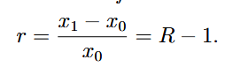

# Markowitz Mean Variance Optimization

### Notes Reference

[
https://sites.math.washington.edu/~burke/crs/408/fin-proj/mark1.pdf 
]()

[https://www.stat.cmu.edu/~ryantibs/convexopt-F16/scribes/kkt-scribed.pdf]()

## Notes:

### Definitions

Primal and Dual Problems:
- Dual is a second problem from the original (primal) functions constraints and objective function
- Dual bounds the primal solution
- Opposite of primal, from a different perspective
- ex. Primal problem wants to maximize, dual wants to minimize 

Karush Kuhn Tucker (KTT) Conditions:
- Set of necessary conditions for a point to be optimal in non linear problems
- Conditions: Stationarity, complementary slackness, primal feasability, dual feasability

### Portfolio Return Rates

Return on asset (ratio):

Rate of return on asset: 

Selling assets you dont own = short selling (shorting).
Example: 
- Get a brokerage to sell some stock that they own, in X amount of stocks
- X stock is credited against your acount, denominated in X stocks, not dollars
- This is considered a negative asset
- You get the money from them selling it, and eventually the brokerage rebuys the stock and you hope it is cheaper than when you sold it

Situation:
- You have a portfolio with *n* assets, and an initial budget of *x0*, wanting to assign a budget to each individual assetg
- Representing budget assigned to asset *i* with *x0i* = *wix0* for i = 1,2...,n and *wi* is a weight for asset i
- Negative weights represent a shorted asset
- Budget preservation requires

and the sum of weights = 1
- The negative value of short weights is important, as getting the money gives you funds to purchase more assets
- *Ri* = return on asset *i*, sum of returns is

- Use the initial formula of rate of return on an asset to find the rate of return on the portfolio

### Markowitz Mean Variance Portfolio Theory

ROR on assets set as random vars, then try to optimize the weighting factors.
Goal: Get minimum ROR with minimum volatility.
Variance in rate of return is a substitute for volatility.
*ri* = random variable for rate of return for asset *i*, for *i* = 1, 2, ..., n and define random vector for all the ROR for all assets

*µi* = E(ri) = expected rate of return for asset i
*m* = the transpose set of all expected ROR µ 
*w* = the transpose set of all weights for each asset in a portfolio
Therefore: expected ROR for portfolio:
 This is also a random variable (because of *ri*), with a mean m(T)*w, and variance w(T) * sum(w).
*µb* = acceptable minimum eROR, therefore must:

*e* is the vector of ones (for all component, e is 1)
